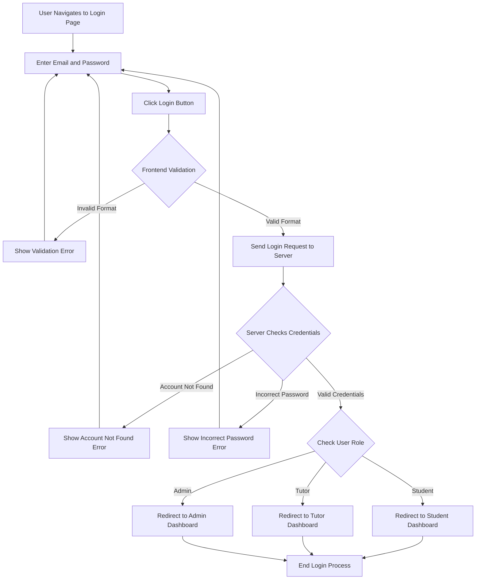
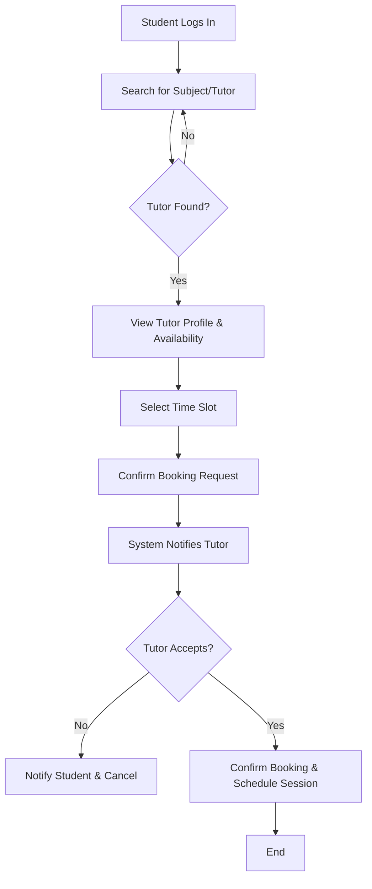
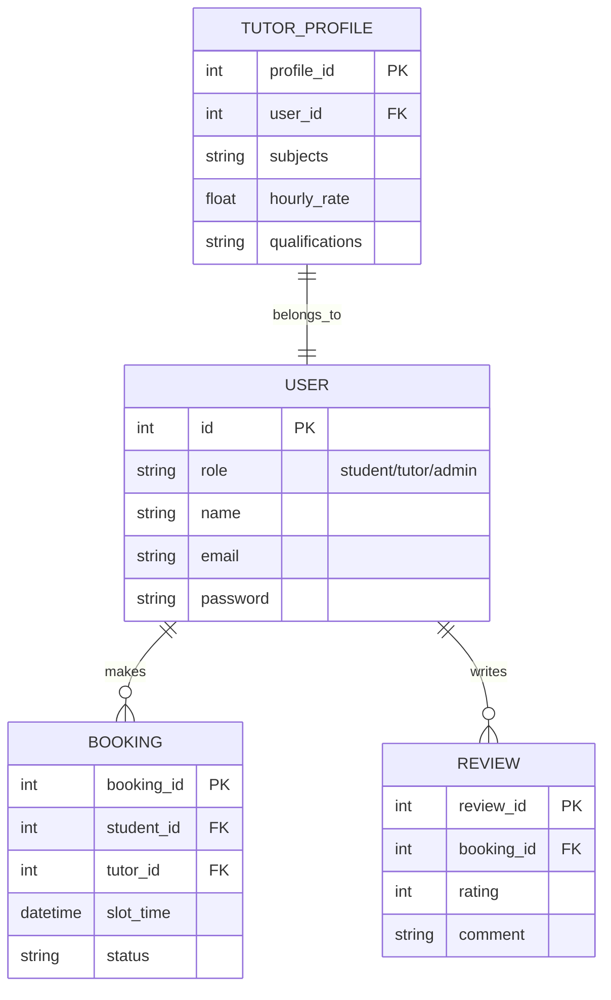
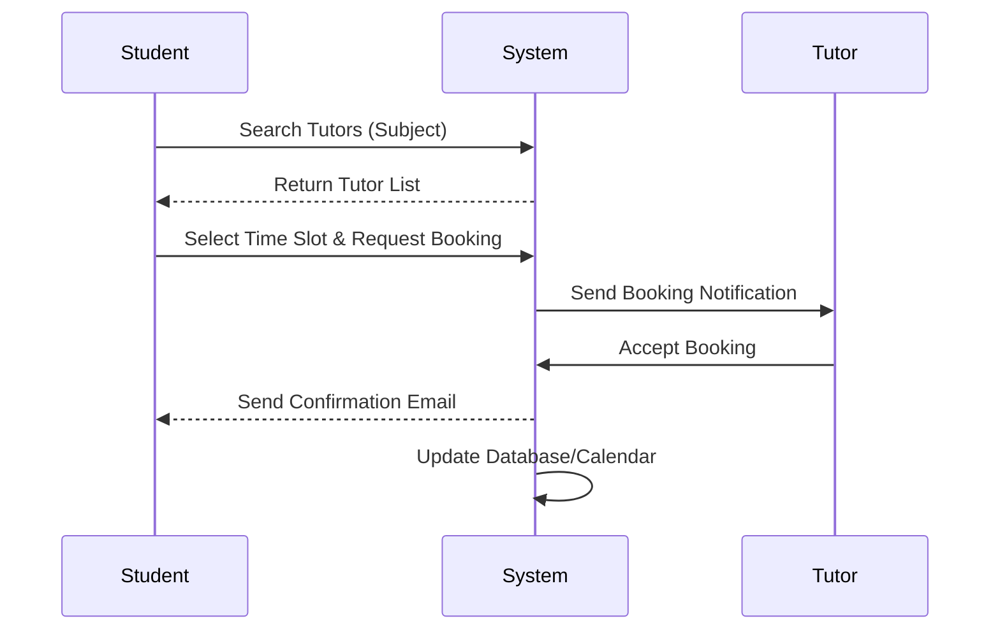

# Dracarys: Tuition Marketplace Platform - Project Documentation

## 1. Project Summary (Refined after Sprint 1)
**Project Name:** Dracarys Tuition Marketplace
**Objective:** To build a comprehensive digital marketplace that connects students seeking academic assistance with qualified tutors. The platform aims to streamline the process of finding, booking, and managing tuition sessions while fostering a supportive educational community.

**Refined Vision:** Based on initial Sprint 1 reviews, the platform focuses heavily on user trust (via reviews and verified profiles), ease of scheduling (calendar integrations), and clear communication channels between students and tutors. It serves as a central hub where students can search for specific subjects and tutors can manage their availability and earnings.

---

## 2. Prioritized User Stories

**High Priority (Core MVP - Sprints 1 & 2)**
* **US-01:** As a student, I want to search for tutors by subject and availability, so that I can find help for my specific needs.
* **US-02:** As a tutor, I want to create a detailed profile highlighting my qualifications and subjects, so that students can assess my expertise.
* **US-03:** As a student, I want to book an available time slot on a tutor's calendar, so that I can schedule a session easily.
* **US-04:** As an administrator, I want to manage user accounts and monitor platform activity to ensure safe and appropriate usage.

**Medium Priority (Enhanced Features - Sprint 3)**
* **US-05:** As a student, I want to leave a rating and review after a session, so that other students can make informed decisions.
* **US-06:** As a tutor, I want to view a dashboard of my upcoming sessions and historical earnings.
* **US-07:** As a user (student/tutor), I want to receive email notifications for booking confirmations and reminders.

---

## 3. Use Case Diagram

### 3.1. Login Phase Use Case Diagram (Current Focus)

```mermaid
usecaseDiagram
    actor User as "User (Student/Tutor/Admin)"

    package "Authentication System" {
        usecase "Enter Credentials" as UC_Login
        usecase "Verify Credentials" as UC_Verify
        usecase "Display Error Message" as UC_Error
        usecase "Redirect to Dashboard" as UC_Redirect
        usecase "Reset Password" as UC_Reset
    }

    User --> UC_Login
    User --> UC_Reset
    UC_Login ..> UC_Verify : <<include>>
    UC_Verify ..> UC_Error : <<extend>> (if invalid)
    UC_Verify ..> UC_Redirect : <<include>> (if valid)
```

### 3.2. Full Platform Use Case Diagram

```mermaid
usecaseDiagram
    actor Student
    actor Tutor
    actor Admin

    package "Tuition Marketplace" {
        usecase "Search for Tutors" as UC1
        usecase "Book Session" as UC2
        usecase "Leave Review" as UC3
        usecase "Manage Profile" as UC4
        usecase "Set Availability" as UC5
        usecase "View Earnings" as UC6
        usecase "Manage Users" as UC7
    }

    Student --> UC1
    Student --> UC2
    Student --> UC3
    Student --> UC4
    
    Tutor --> UC4
    Tutor --> UC5
    Tutor --> UC6
    
    Admin --> UC7
```

---

## 4. Activity Diagrams / Flow Charts

**1. User Login Phase Activity Diagram**
*(To use in draw.io: Go to `Arrange` > `Insert` > `Advanced` > `Mermaid`, paste the code below, and click Insert).*



---

**2. Booking a Tuition Session Flow**


---

## 5. Wireframes

Since physical wireframes are visual, here is a structural layout (UI Blueprint) for the key pages which you can recreate in Figma, Balsamiq, or draw by hand:

**1. Home/Search Page**
* **Header:** Logo (left), Navigation Links (Search, Log In, Sign Up).
* **Hero Section:** Catchy tagline ("Find your perfect tutor today"), large Search Bar (Input: Subject, Dropdown: Level/Price).
* **Body:** "Featured Tutors" grid cards (Photo, Name, Subjects, Star Rating).
* **Footer:** About Us, Contact, Terms & Conditions.

**2. Tutor Profile Page**
* **Left Column:** Tutor Photo, Name, Bio, Qualifications, Overall Rating.
* **Right Column:** Interactive Calendar (showing available green slots), "Book Now" CTA button.
* **Bottom Section:** Reviews from past students.

---

## 6. Other Artefacts

### Entity-Relationship Diagram (ERD)


### Sequence Diagram: Session Booking


---

## 7. Sprint 3 Kanban & Administrative Tasks Checklist

To complete your assessment submission, ensure you have gathered the following external items:

- [ ] **Sprint 3 Tickets on Kanban Board:** Create tickets for Sprint 3 tasks (e.g., "Implement Review System", "Frontend Tutor Dashboard", "Fix Booking Bug"). Assign each ticket to a specific group member.
- [ ] **Kanban Board Screenshot:** Take a clear screenshot of your Trello/Jira/GitHub Projects board showing columns like "To Do", "In Progress", "Review", and "Done".
- [ ] **Meeting Records:** Ensure your meeting minutes/logs for Sprint 1 and 2 are documented (date, attendees, topics discussed, action items).
- [ ] **Task Board Link:** Copy the shareable URL of your Kanban board.
- [ ] **GitHub Link:** Provide the link to your repository (`https://github.com/.../Dracarys-Repo`).

*(Fill in your actual links before submitting your final document)*
